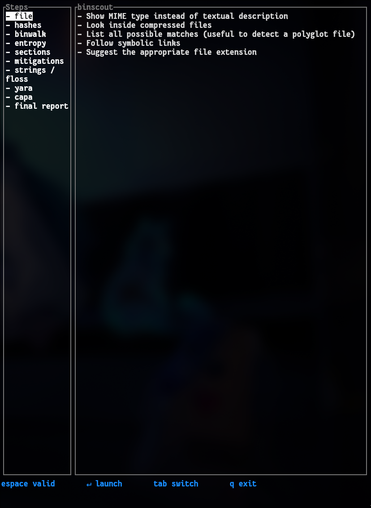

# 🔍 BinScout - The Rust's TUI Cyber Wrapper

> *Cyber tooling, without the command line.*


---

## ✰ Highlights

- ☕︎ **Interactive Terminal User Interface** : fully keyboard-driven, no commands to memorize
- ▶ **Unified wrapper** around the most popular binary analysis tools
- ▶ **Step-by-step guided workflow**, from file identification to the final report
- 🦀 **Written in Rust** : fast, reliable, and lightweight
- ▶ Built for **malware analysts, pentesters, and CTF players**
- ▶ Report export in **Markdown and JSON**
- ▶ **Headless mode** for scripting, **directory triage**, **presets** and a config file
- ▶ Fuzzy file picker, hex viewer, search, live tool output, one-key install of missing tools

---

## ⓘ Overview

BinScout is a TUI *(Terminal User Interface)* wrapper written in Rust that brings together the most common binary analysis tools into a single interactive, guided interface. No more long commands to retype, forgotten flags, or unreadable output: BinScout walks you through every step of an analysis, from the raw file all the way to the final report.

Under the hood, BinScout is built with [`ratatui`](https://github.com/ratatui-org/ratatui) and [`crossterm`](https://github.com/crossterm-rs/crossterm), giving it a snappy and responsive terminal experience.

<!-- Remplace ce lien par ton screenshot principal -->
<p align="center">
  
</p>

The interface is split into **16 analysis steps**:

| Step | Tool / Action | Native |
|------|---------------|--------|
| 1  | File identification (`file`) | |
| 2  | Hashes (MD5, SHA1, SHA256, ssdeep, imphash), VirusTotal & MalwareBazaar lookups | ✔ |
| 3  | Packer & compiler detection (UPX, ASPack, Themida, VMProtect… / GCC, MSVC, Go, Rust, .NET, PyInstaller…), packing heuristics, UPX unpack | ✔ |
| 4  | Archive / container: list and extract zip, jar, apk, tar, 7z, rar, deb, rpm, cab, iso, msi | |
| 5  | Structure carving (`binwalk`) | |
| 6  | Entropy analysis (whole file, per section, sliding window, ASCII graph) | ✔ |
| 7  | Sections & headers, import/export tables (ELF, PE, Mach-O) | ✔ |
| 8  | Mitigations (NX, PIE, RELRO, canary, Fortify, ASLR, CFG, SafeSEH…) and dangerous imports | ✔ |
| 9  | Anti-analysis indicators (debugger, VM/sandbox, timing, injection, TLS callbacks, tool names) | ✔ |
| 10 | Strings (`strings`, native fallback) & FLOSS | |
| 11 | Indicators of compromise: URLs, IPs, domains, emails, paths, registry keys, base64, wallets, user agents, mutexes | ✔ |
| 12 | YARA | |
| 13 | capa | |
| 14 | Disassembly around the entry point (`objdump`), function list (`rizin` if installed) | |
| 15 | Compare with another binary: hashes, sections, imports/exports, strings, ssdeep similarity | ✔ |
| 16 | Final report (Markdown / JSON) | ✔ |

*Native* steps are implemented in Rust (via [`goblin`](https://github.com/m4b/goblin)) and need no external tool; they work on ELF, PE and Mach-O alike.

Each step exposes **configurable options** directly from the interface: you check what you want, and BinScout handles the underlying command for you.

### 🎯 Who is it for?

BinScout is built for:

- **Malware analysts** who run regular triage and investigation
- **Pentesters** who need quick binary inspection without context-switching to the man pages
- **CTF players** looking to speed up the reverse-engineering grind
- **Students** discovering binary analysis tooling without the steep CLI learning curve

### ✍️ Author

Created and maintained by Jorg Hunter. BinScout started as a way to stop memorizing dozens of flags across half a dozen tools and turn the whole workflow into something approachable and fast.

---

## ✈︎ Usage instructions

Launch BinScout with the file to analyze, or pick it later from the interface:

```bash
binscout ./suspicious.bin
# or
binscout            # then press @ to open the file picker
```

Then navigate entirely with the keyboard:

| Key             | Action                                                        |
|-----------------|---------------------------------------------------------------|
| `↑` / `↓`       | Move between steps, options, or scroll the output             |
| `Tab` / `⇧Tab`  | Next / previous step                                          |
| `Enter` / `→`   | Enter the options of the selected step                        |
| `Enter`         | Toggle an option (opens a prompt when the option needs a value)|
| `Space`         | **Run** the selected step with the checked options            |
| `r`             | Run every step that has at least one option checked           |
| `v`             | Show the flag behind each option and the exact command line that `Space` would run |
| `p`             | Presets: pick a set of options (`Enter` apply, `r` apply and run) |
| `o`             | Show / hide the last output of the selected step              |
| `@`             | Fuzzy file picker to choose the target                        |
| `c`             | Pick a second file and run the *compare* step                 |
| `x`             | Hex viewer of the target (`g` to jump to an offset)           |
| `t`             | Triage every file in the target's directory                   |
| `i`             | Doctor: installed tools, and install the missing ones         |
| `/`, `n`, `N`   | In the output: search, next / previous match                  |
| `e`             | In the output: open it (or the written report) in `$EDITOR`   |
| `y`             | In the output: copy it to the clipboard                       |
| `Esc` / `←`     | Go back (output → options → steps)                            |
| `q` / `Ctrl+C`  | Quit                                                          |

The interface is laid out in two panes:

- **Left pane (`Steps`)** : the list of the 16 analysis stages, with a `✓` / `✗` / `–` marker once a step has run
- **Right pane** : the configurable options of the selected step, or its scrollable output once it has run

Running a step with nothing checked uses sensible defaults (e.g. plain `file`, the three standard hashes, all mitigation checks). Press `v` to see, next to every checkbox, what it adds (`file -k`, `binwalk -E`, `yara -s`, or the native analysis behind it), and below the list the exact command line the current selection would run — computed by a dry run of the real engine, so it never drifts from what is executed.

### Command line

```bash
binscout                       # TUI, pick a file with @
binscout sample.bin            # TUI on a file
binscout samples/              # TUI opening on a triage table of the directory
binscout --run-all sample.bin  # headless: preset "quick", writes binscout-report-sample.bin.md
binscout --run-all -p full --report md,json -o reports/ sample.bin
binscout --triage samples/     # one line per file: type, entropy, packer, anti-analysis score, sha256
binscout --triage --online samples/   # + MalwareBazaar verdict per file
binscout --load binscout-report-sample.bin.json   # resume a session from a JSON report
binscout --list-presets
binscout --doctor
```

`--run-all` exits with 1 when a step failed, `--doctor` with 1 when a tool is missing.

### Presets & configuration

Built-in presets: **quick** (native steps only, a few seconds), **full** (everything that runs offline, external tools included) and **online** (quick + VirusTotal + MalwareBazaar). Add your own in `~/.config/binscout/config.toml` — see [`docs/config.example.toml`](docs/config.example.toml):

```toml
vt_api_key = "..."
bazaar_api_key = "..."
yara_rules = "~/.config/binscout/rules"
default_preset = "quick"

[presets.ctf]
hashes = ["sha256", "md5"]
"strings / floss" = ["Classic", "Minimum strings length=8"]
```

### File picker (`@`)

Type to fuzzy-filter the files below the current directory. Start the query with `/` or `~` to search from an absolute directory instead (`~/Downloads/mal`, `/tmp/…`). `Enter` selects the highlighted file.

### Reports

The **final report** step writes `binscout-report-<file>.md` and/or `.json` in the current directory, with one section per step that ran, optionally the raw tool transcripts as an appendix, and the list of steps that were not run.

### Doctor: missing tools

BinScout detects your system (distribution, package manager, `pipx`/`pip`) and checks which external tools are in your `PATH`. Missing tools are greyed out and listed in the status bar at startup. Press `i` to open the doctor screen: `Enter` installs the highlighted tool, `a` installs all missing ones. BinScout leaves the TUI, runs the command (e.g. `sudo apt install -y ssdeep && pipx install flare-floss flare-capa`, so `sudo` may ask for your password), then comes back and re-checks.

The same check is available from the command line, which exits with status 1 when something is missing:

```bash
binscout --doctor
```

### Online lookups

- **VirusTotal**: set `vt_api_key` in the config file or `VT_API_KEY` in the environment.
- **MalwareBazaar** (abuse.ch): needs a free Auth-Key from <https://auth.abuse.ch/> — `bazaar_api_key` or `MALWAREBAZAAR_API_KEY`.

Nothing is sent online unless one of these options is checked (only the SHA-256 is sent, never the file).

<!-- Remplace ce lien par ton GIF de démo -->
<p align="center">
  
</p>

---

## ￬ Installation instructions

> **Status:** BinScout is in early development. Build from source for now.

### Requirements

- [Rust toolchain](https://rustup.rs/) (stable)
- A Unix-like terminal (Linux / macOS recommended)
- The external tools you want to wrap, available in your `PATH`: `file`, `binwalk`, `strings`/`objdump` (binutils), `yara`, `capa`, `floss`, `ssdeep`, `upx`, and `unzip`/`7z` for archives. A missing tool only disables its step (it is shown greyed out) and the doctor (`i`) installs it for you. Nine of the sixteen steps are native Rust and need nothing.
- Optional: a YARA rule set, e.g. `git clone https://github.com/Yara-Rules/rules ~/.config/binscout/rules`

### Build from source

```bash
git clone https://github.com/ByyLafe/binscout
cd binscout
cargo build --release
```

The compiled binary will be available at `target/release/binscout`.

To run it directly during development:

```bash
cargo run
```

---

## 🗺️ Roadmap

- [x] Option toggling, value prompts, presets and a config file
- [x] Execution of the underlying tools with live output, run-all, headless mode
- [x] Markdown & JSON reports, session resume
- [x] Native packer / compiler detection, anti-analysis indicators, IOC extraction
- [x] VirusTotal and MalwareBazaar lookups
- [x] Fuzzy file picker, hex viewer, output search, editor / clipboard hand-off
- [x] Archive listing & extraction, binary comparison, directory triage
- [x] Doctor: OS / package-manager detection and one-key install of missing tools
- [ ] Recursive triage with a summary report
- [ ] Rich header / resources / version info / Authenticode details for PE
- [ ] Sandbox integration (dynamic analysis)

---

## 💭 Feedback & contributions

Found a bug, have an idea, or want to add support for another tool? Open an [issue](https://github.com/ByyLafe/binscout/issues) or start a [discussion](https://github.com/ByyLafe/binscout/discussions): contributions are very welcome!

If you'd like to contribute code, fork the repo, create a feature branch, and open a pull request.

---

## 📖 Further reading

- [ratatui : Rust TUI library](https://github.com/ratatui-org/ratatui)
- [crossterm : cross-platform terminal manipulation](https://github.com/crossterm-rs/crossterm)
- [binwalk](https://github.com/ReFirmLabs/binwalk)
- [YARA](https://github.com/VirusTotal/yara)
- [capa](https://github.com/mandiant/capa)
- [FLOSS](https://github.com/mandiant/flare-floss)

---

*Made with 🦀 and a healthy dislike for typing the same flags over and over.*
